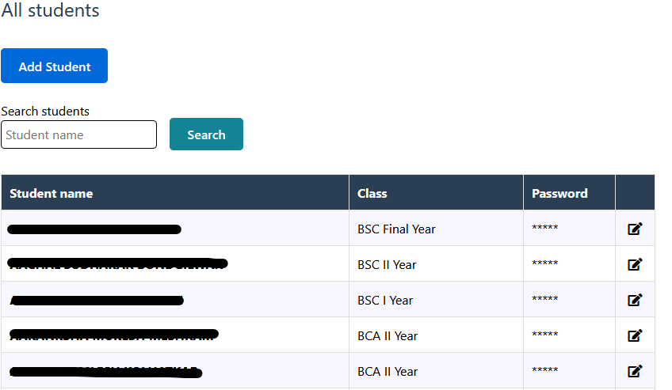

# Online Attendance System

Welcome to the Online Attendance System, a Django-based web application designed to simplify the process of managing and tracking student attendance in classes. This system provides a secure and user-friendly interface for both teachers and students.

## Installation
1. Clone the Repo
```bash
git clone https://github.com/vilash99/attendance_project.git
```
2. Setup virtual environment & Install Requirements

```bash
python -m venv .venv
.venv/Scripts/activate
pip install -r requirements.txt
```
3. Migrate Database and create superuser

```bash
python manage.py migrate
python manage.py createsuperuser
```
4. Make app migration
```bash
python manage.py makemigrations
python manage.py migrate
```
Then go to the browser and enter the url **http://127.0.0.1:8000/**


## Features

### 1. Manage Students:
Add/Edit students with fields such as Name, Class, and Password.



### 2. Manage Teachers
Add/Edit teachers with their names.


### 3. Initiate Attendance
Start attendance for any class by clicking the provided button.


###  4. Attendance Input
Input attendance details, including Teacher's name, subject name, class unique code, and total students present.


### 5. Monitor Active Attendance
Check the status of active attendance and view the count of students who have marked their attendance.

### 6. End Attendance
Teachers can end attendance when the attendance session is complete.

### 7. Class-Specific URLs
Each class has a separate URL. Students can mark their attendance by selecting their name, entering their password, and using the unique code provided by the teacher. If there is no attendance is active for given class, then page with no attendance will appear.

### 8. Blacklist Students
Option to blacklist students who attempt to mark attendance falsely.

### 9. Detailed Attendance Reports
View detailed attendance reports for each student and all students in a given class.


### 10. Search and Filter Options
Search for student names and filter attendance reports by month.

### 11. Class Reports
Teachers can view class reports, including the number of classes taken. Reports can be filtered by month.


### 12. Password Protection
All pages are password-protected and cannot be accessed publicly. Student attendance pages are accessible only when the teacher initiates attendance for a specific class.

## Contribution
Feel free to contribute to the project by submitting bug reports, feature requests, or pull requests. Your contributions are highly appreciated.

## License
This project is licensed under the MIT License.

## Contact me
If you need any web app similar to this or have new requirements. You can contact me at **vdaate[at]gmail[com].**

My website: https://www.vpktechnologies.com/